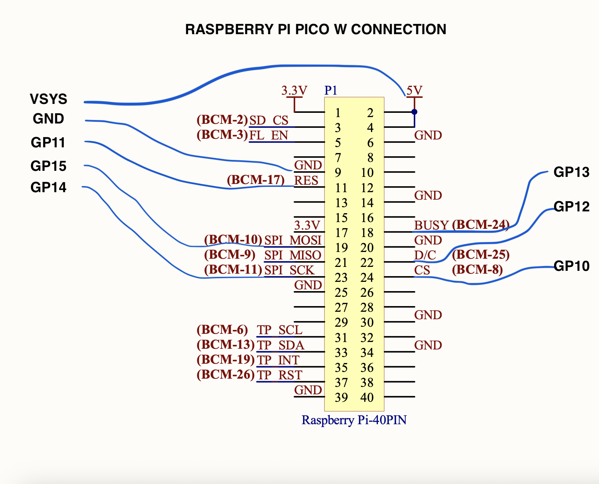

# Issues with the UC8253 E-Paper Display

This document describes the issues encountered while trying to get the display working using the driver contained in this repository.

The program is designed to run on a **Raspberry Pi Pico W** and can be executed using the following command:

```bash
cargo run --release
```

## ESP32-FTS02 Connection Schematic
ESP32-FTS02 full original schematic: https://v4.cecdn.yun300.cn/100001_1909185148/ESP32-FTS02_SCH-20250819.pdf


## Stuck BUSY signal

The main problem encountered concerns the **BUSY** signal. It seems that this signal never goes high, preventing the program from proceeding with execution.

The block occurs within the [busy_block](uc8253/src/lib.rs#L330) function in the `uc8253/src/lib.rs` file.

## Workaround attempt (Dummy Busy)

As indicated in the comments within the `busy_block` function, an attempt was made to bypass the problem by simulating the busy signal with a dummy 1-second wait:

```rust
// IT LOOKS THAT BUSY SIGNAL NEVER GOES HIGH AND THE PROGRAM STOP HERE; WE CAN BYPASS IT BY WAITING 1000MS
self.busy.wait_for_high().await.map_err(Error::BSY)?;
// self.delay.delay_ms(1000).await;
```

Despite using this artificial delay to allow the program to move forward, the display still does not function correctly.
